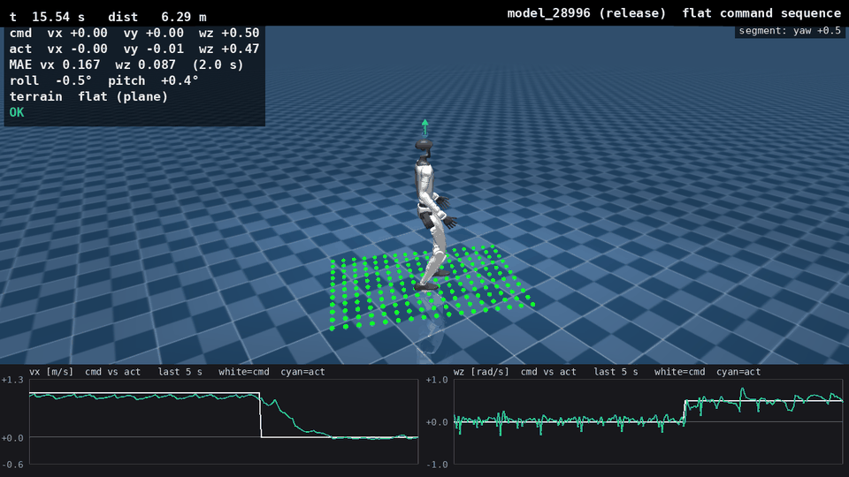
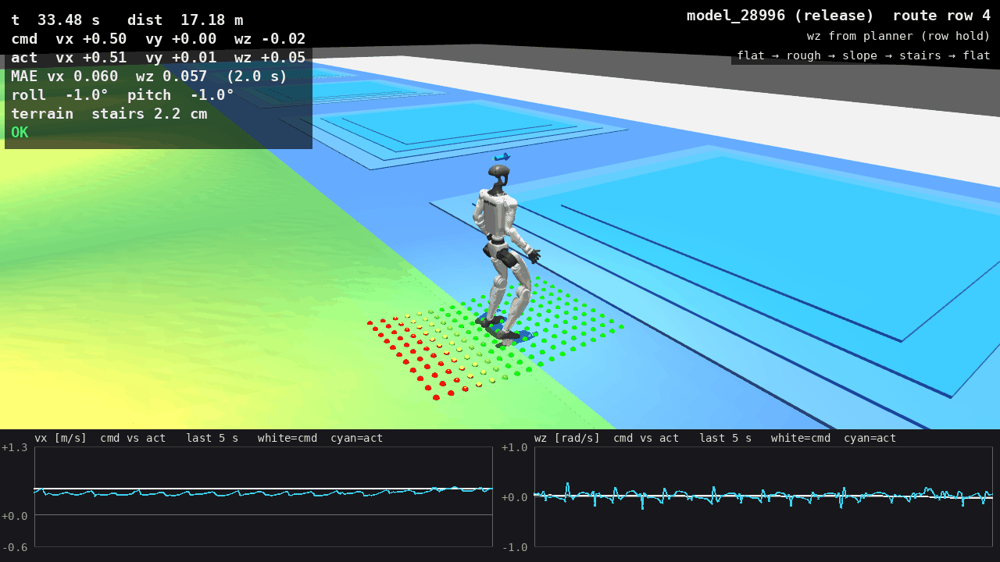
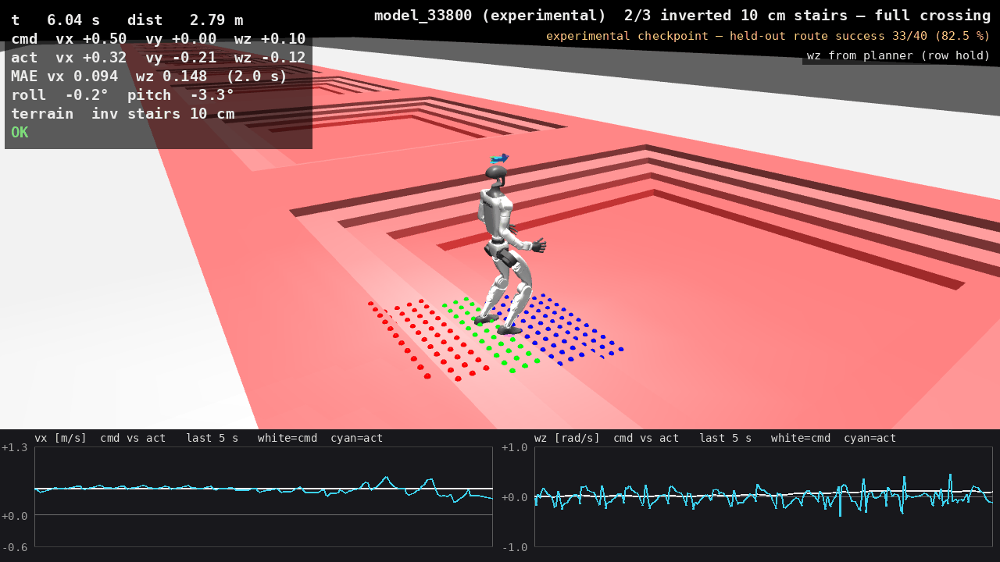
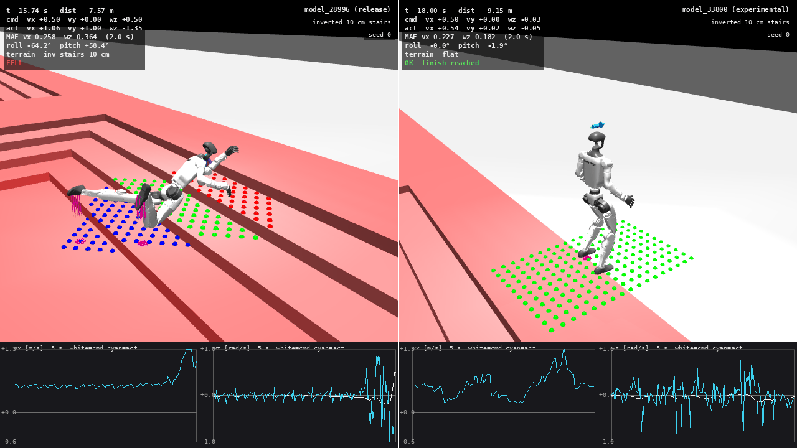

# G1 Humanoid Locomotion

A terrain-aware locomotion policy for the Unitree G1 humanoid (29 DoF),
trained with reinforcement learning in [MuJoCo Lab (mjlab)](https://github.com/mujocolab/mjlab)
and evaluated on a continuous route: flat ground, random roughness, a slope,
low steps, and flat ground again. One checkpoint drives the whole route. The
policy receives proprioception, a velocity command, and a 187-point local
height scan; it never receives a terrain label. A terrain-agnostic path
controller changes only the yaw-rate command to keep the robot on its row.

Everything runs in one Docker image on an NVIDIA GPU: acceptance tests,
flat-ground command tests, terrain-seam tests, video rendering, ONNX export
checks, a sim-to-sim run in Unitree's MuJoCo model, and training.

This repository is the curated release of work developed in a private
research repository with more than 140 logged decisions, experiments and
reviews. The results below are **simulation results**. Neither checkpoint
has been run on a physical G1.

| Checkpoint | Status | Files |
| --- | --- | --- |
| `model_28996` | Release. Accepted on the row-4 route. | [`weights/`](weights/) (`.pt`, `.onnx`, [manifest](weights/manifest.json)) |
| `model_33800` | Experimental 10 cm stair policy. Failed its held-out gate. | [`weights/`](weights/) (`.pt`, `.onnx`) |

## Results: release checkpoint `model_28996`

### Continuous route (acceptance)

Terrain row 4 of 10: roughly 10° slope and 2.22 cm steps. Forward command
0.5 m/s; 20 robots per seed, 60 s limit. A run passes if the robot reaches
the end of the route without falling or leaving its terrain row.

| Seed | Completed | Falls | Timeouts | Left row | Forward-speed MAE |
| ---: | ---: | ---: | ---: | ---: | ---: |
| [0](docs/results/release_route_row4/seed0.json) | 19/20 | 0 | 1 | 0 | 0.0577 m/s |
| [1](docs/results/release_route_row4/seed1.json) | 18/20 | 0 | 2 | 0 | 0.0604 m/s |
| [2](docs/results/release_route_row4/seed2.json) | 17/20 | 0 | 3 | 0 | 0.0609 m/s |

Acceptance limits: at least 17/20 completions per seed, forward-speed MAE at
most 0.15 m/s, a success-rate spread across seeds of at most 15 percentage
points, and at most two falls within 1 s of any terrain boundary. All checks
passed ([verdict](docs/results/release_route_row4/verdict.json)). A rerun with
this repository's image on the same RTX 2060 gave 19/20, 18/20, and 18/20
([verdict](docs/results/release_route_row4_rerun/verdict.json)). MuJoCo Warp
on GPU is not bit-for-bit deterministic, so the same seed can give a
different count. Treat these as measured results, not guarantees.

### Isolated surfaces and flat ground

Seed 0, 20 robots, terrain row 4. Each episode ends at the edge of its
starting tile, typically after 6–13 s, so these tests measure crossing a
tile, not 60 s of walking.

| Surface | Falls at 0.5 m/s | Falls at 0.8 m/s |
| --- | ---: | ---: |
| Random roughness | [0/20](docs/results/isolated_surfaces_28996/RandomRough/0.5_0_0.json) | [0/20](docs/results/isolated_surfaces_28996/RandomRough/0.8_0_0.json) |
| Uphill slope | [0/20](docs/results/isolated_surfaces_28996/Slope/0.5_0_0.json) | [0/20](docs/results/isolated_surfaces_28996/Slope/0.8_0_0.json) |
| Downhill slope | [0/20](docs/results/isolated_surfaces_28996/SlopeInv/0.5_0_0.json) | [0/20](docs/results/isolated_surfaces_28996/SlopeInv/0.8_0_0.json) |

On flat ground the checkpoint passes all nine required command scenarios
(stand; forward 0.5 and 1.0 m/s; yaw ±0.5 rad/s; forward with yaw; lateral
±0.4 m/s; braking): 20 robots × 60 s each, no falls, forward-speed MAE
0.038 m/s at 0.5 m/s ([summary](docs/results/flat_protocol_28996/stage1_meta.json),
[rerun](docs/results/flat_protocol_28996_rerun/stage1_meta.json)). At a 5 cm
step height (row 9), all 20 robots left the starting tile without falling on
both [regular](docs/results/stairs_tiles_28996/stairs5_row9_seed0.json) and
[inverted](docs/results/stairs_tiles_28996/stairs_inv5_row9_seed0.json)
stairs. Those tile tests last about 10 s.

### Export and sim-to-sim

- **ONNX parity.** The exported ONNX actor matches the torch actor to a
  maximum absolute difference of 1.4e-6 over 17,400 action values (tolerance
  1e-4). A different checkpoint used as a negative control differs by 0.49
  ([result](docs/results/onnx_parity/onnx_parity_28996.json)).
- **unitree_mujoco.** The ONNX policy runs in Unitree's own G1 MJCF model in
  plain MuJoCo, without mjlab or torch. With a constant 0.5 m/s command on
  flat ground it walked for 60 s without falling: forward-speed MAE 0.047 m/s
  and no torque saturation
  ([result](docs/results/sim2sim_28996/unitree_mujoco_flat_60s.json)).
- **Open-loop heading drift.** With no steering, the heading drifted by 77°
  over the first 20 m in unitree_mujoco, versus a median of 22° (max 38°,
  20 robots) in mjlab ([result](docs/results/sim2sim_28996/mjlab_openloop_drift/result.json)).
  The same runner and command reproduce the parent checkpoint `model_18997`
  bit for bit at −4° over 20 m
  ([control](docs/results/sim2sim_28996/control_parent_18997_flat_60s.json)),
  so the larger drift is a property of `model_28996` in Unitree's model, not
  a runner fault. Changing the physics step or using mjlab joint parameters
  does not remove it (55–80° over 20 m,
  [variants](docs/results/sim2sim_28996/)). In the route evaluation in
  mjlab, the path controller closes the heading loop.

## Videos

| | |
| --- | --- |
| [](media/flat_commands_28996.mp4) | [](media/route_28996.mp4) |
| `model_28996`: stand, forward 0.5 and 1.0 m/s, yaw ±0.5 rad/s, lateral ±0.4 m/s, brake | `model_28996`: flat → roughness → ~10° slope → 2.2 cm steps → flat; yaw rate from the row-holding controller |
| [](media/stairs10_33800.mp4) | [](media/inverted10_before_after.mp4) |
| `model_33800`: regular and inverted 10 cm stairs, route with fixed 10 cm steps | Inverted 10 cm stairs, same seed and initial state: `model_28996` falls, `model_33800` crosses |

The overlay shows the command, body-frame velocity, a 2 s rolling MAE, roll
and pitch, the terrain under the robot, and the 187 height-scan points
coloured by relative height. The overlay MAE matches the evaluation code to
1e-8 on the same steps. Each command clip lasts 4.5 s and includes the
acceleration after a command change, so its MAE is higher than the 60 s
values above. Videos use CPU physics; the tables use GPU runs.

## Experimental: 10 cm stairs (`model_33800`)

`model_33800` is a fine-tune aimed at regular and inverted 10 cm stairs with
the same 283-input interface. It is not part of the release manifest. It was
chosen among several checkpoints using seeds 0–2, so those seeds measure
selection, not generalization. Seeds 4 and 5 were fixed as held-out before
the held-out run; seed 3 was used in training and is a control. Each cell is
20 runs of 60 s; the pre-registered criterion was at least 17/20 per seed.

| Scenario | Seed 0 | Seed 1 | Seed 2 |
| --- | ---: | ---: | ---: |
| Regular stairs, full crossing | 19/20 | 19/20 | 19/20 |
| Inverted stairs, full crossing | 18/20 | 19/20 | 19/20 |
| Route with fixed 10 cm steps | 19/20 | 18/20 | 18/20 |

*Selection seeds ([verdict](docs/results/stairs10_selection/verdict.json)).*

The fixed-10 cm route is not bit-reproducible on the GPU: the same seed,
checkpoint, task and configuration give different counts from run to run.

| Fixed 10 cm route, seed 0 | Runs | Passed per run | Total |
| --- | ---: | --- | ---: |
| Development image | 4 | 19, 19, 17, 17 | 72/80 |
| This repository's image | 5 | 15, 16, 17, 18, 19 | 85/100 |

*Sources: [selection](docs/results/stairs10_selection/verdict.json), [rerun](docs/results/stairs10_selection_rerun/verdict.json), [repeats](docs/results/stairs10_seed0_repeats/). Task configuration and evaluation logic are identical in both images; only import paths differ. The full rerun gave 15/16/19 on the route and FAIL; stairs alone stayed at 19–20/20.*

| Scenario | Seed 3 (training) | Seed 4 (held-out) | Seed 5 (held-out) |
| --- | ---: | ---: | ---: |
| Regular stairs, full crossing | 17/20 | 17/20 | 19/20 |
| Inverted stairs, full crossing | 18/20 | 19/20 | 17/20 |
| Route with fixed 10 cm steps | 19/20 | **16/20** | 17/20 |

*Held-out seeds: [verdict](docs/results/stairs10_heldout/verdict.json) FAIL.*

On the held-out seeds the route succeeded in 33 of 40 runs (82.5 %; 95 %
Wilson interval 68–91 %), and every fall happened on the stair tile. For a
policy with an 85 % true success rate, a ≥17/20 gate passes on all three
seeds only about 27 % of the time, so part of the selection-seed pass came
from selection. Pooling every fixed-10 cm route run (16 runs of 20 robots
on seeds 0–5, both images) gives 280/320 = 87.5 % (95 % Wilson interval
83–91 %; selection seeds are included, so this is an upper estimate). At that rate the three-seed gate
passes only about 45 % of the time, so the policy is not stable enough for
release. The release checkpoint therefore stays `model_28996`.
Protocol, training settings, and reproduction steps:
[docs/stairs10-experiment.md](docs/stairs10-experiment.md).

## Quick start

Requirements: Linux x86-64, an NVIDIA GPU with a recent driver, Docker
Engine with Compose, and the
[NVIDIA Container Toolkit](https://docs.nvidia.com/datacenter/cloud-native/container-toolkit/install-guide.html).
The image is about 10.6 GB. The host needs no Python packages.

```bash
docker compose build eval-route          # one image for all services
docker compose run --rm eval-route       # release acceptance, 3 seeds × 20 robots × 60 s
```

The weights are mounted read-only from `weights/` at `/model`, and results
are written to `outputs/`. Every service runs the image's Python interpreter.
Pass a script path and arguments to replace the default command.

| Service | Default command | Quick check |
| --- | --- | --- |
| `eval-route` | Release acceptance on the row-4 route (≈6 min on an RTX 2060) | `docker compose run --rm eval-route /app/scripts/eval_route.py --smoke` |
| `eval-flat` | Nine required flat-ground commands, 20 × 60 s | see [docs/container.md](docs/container.md#smoke-tests) |
| `eval-stairs10` | Full 10 cm stair protocol for `model_33800` (seeds 0–2) | see [docs/container.md](docs/container.md#smoke-tests) |
| `eval-transitions` | Flat → 5 cm stairs seam on rows 0/4/9 | see [docs/container.md](docs/container.md#smoke-tests) |
| `render` | HUD video of the flat command sequence | see [docs/container.md](docs/container.md#smoke-tests) |
| `onnx-parity` | torch vs ONNX Runtime parity for `model_28996` | runs in about 1.5 min |
| `sim2sim` | ONNX policy in the unitree_mujoco G1 model, 60 s | runs in seconds |
| `train` | mjlab training entry point (profile `train`) | `docker compose --profile train run --rm train /app/scripts/train.py G1-Mix3-Deploy-NoCmdCurriculum-SymLoss-YawW4 --env.scene.num-envs 64 --agent.max-iterations 2 --agent.logger tensorboard --log-root /outputs/train` |

The acceptance runner checks the checkpoint hash, network dimensions,
dependency versions, the mjlab commit, the `uv.lock` hash, and a hash of the
evaluation sources before it starts. It exits with a nonzero status if any
acceptance check fails. See [docs/container.md](docs/container.md) for all
commands and outputs.

## Repository layout

| Path | Contents |
| --- | --- |
| [`src/g1_locomotion/tasks/`](src/g1_locomotion/tasks/) | mjlab task definitions: deploy observations, terrain mixes, stair and route evaluation tasks |
| [`src/g1_locomotion/`](src/g1_locomotion/) | Evaluation harness, route and stair evaluators, terrain-seam rollout, mirror map for the symmetry loss, sim-to-sim observation builder |
| [`scripts/`](scripts/) | Entry points: acceptance, flat protocol, stair protocols, seams, video, ONNX export and parity, sim-to-sim, training |
| [`weights/`](weights/) | Checkpoints, ONNX exports, release manifest, checksums |
| [`docs/`](docs/) | [Policy interface](docs/model-contract.md), [container usage](docs/container.md), [engineering notes](docs/engineering-notes.md), [10 cm experiment](docs/stairs10-experiment.md), [result files](docs/results/) |
| [`docker/`](docker/), [`compose.yaml`](compose.yaml) | Image definition and GPU services |
| [`third_party/unitree_mujoco/`](third_party/unitree_mujoco/) | Unitree G1 MJCF model for the sim-to-sim check (BSD 3-Clause) |
| [`tests/`](tests/) | Observation-history regression test for partial environment resets |
| [`media/`](media/) | Videos and their preview frames |

## Limitations

- The release route uses 2.22 cm steps. It does not show full-size stair
  climbing. On isolated inverted 10 cm steps, `model_28996` fell in
  [20/20](docs/results/stairs_tiles_28996/stairs_inv10_row9_seed0.json) runs
  at seed 0 and [18/20](docs/results/stairs_tiles_28996/stairs_inv10_row9_seed1.json)
  at seed 1.
- The harder row-9 route completed [16/20](docs/results/limits_28996/route_row9_seed0.json)
  runs. All four failures were falls on the roughly 21.8° slope before the
  steps.
- Backward tracking is weaker: on flat ground the forward-speed MAE was
  [0.101 m/s](docs/results/flat_protocol_28996/back_03.json) at −0.3 m/s and
  [0.136 m/s](docs/results/flat_protocol_28996/back_05.json) at −0.5 m/s,
  above the 0.10 m/s diagnostic limit. Neither command caused a fall in 20 runs.
- The random-roughness amplitude is fixed at 0.02–0.06 m on every terrain
  row, so a higher row does not mean rougher ground.
- There is no accepted sim-to-sim or hardware result. In unitree_mujoco the
  release policy drifts in heading far more than in mjlab, and only flat
  ground has been tested there.
- The training service starts and runs iterations inside the image, but
  reproducing a checkpoint end to end has not been verified. The release
  checkpoint comes from a chain of resumed runs; see
  [engineering notes](docs/engineering-notes.md).

## Acknowledgements

- [MuJoCo Lab (mjlab)](https://github.com/mujocolab/mjlab): environment,
  G1 velocity task, terrain generators, and training entry point; pinned at
  commit `c2e1e06`.
- [MuJoCo](https://github.com/google-deepmind/mujoco) and
  [MuJoCo Warp](https://github.com/google-deepmind/mujoco_warp): physics.
- [RSL-RL](https://github.com/leggedrobotics/rsl_rl): PPO and the symmetry
  extension. Mirror loss follows Mittal et al., "Symmetry Considerations for
  Learning Task Symmetric Robot Policies", ICRA 2024.
- [Unitree Robotics](https://github.com/unitreerobotics/unitree_mujoco): the
  G1 robot model; the vendored MJCF files keep their BSD 3-Clause license.

## License

Apache License 2.0 — see [LICENSE](LICENSE). The Unitree G1 model files in
[`third_party/unitree_mujoco`](third_party/unitree_mujoco) are distributed
under their own BSD 3-Clause license, included in that directory.
Dependency licenses are listed in [THIRD_PARTY_NOTICES.md](THIRD_PARTY_NOTICES.md).
